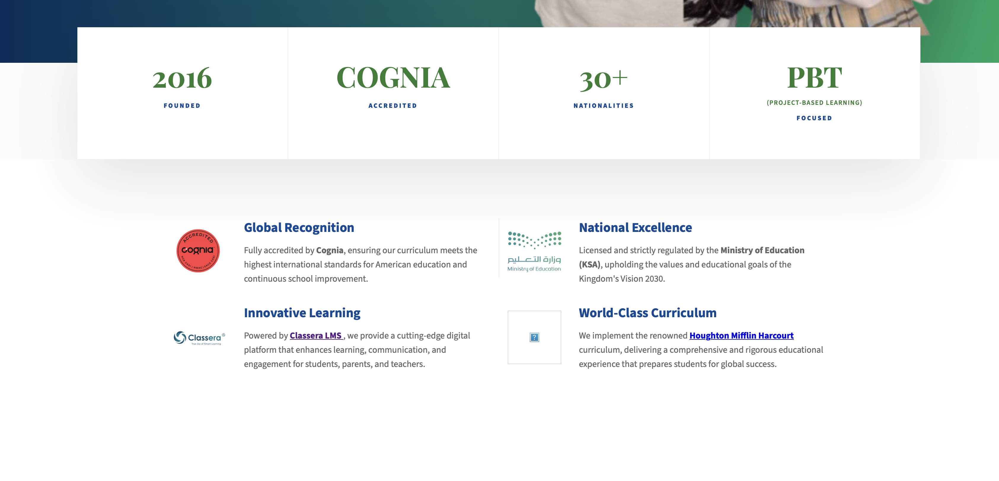
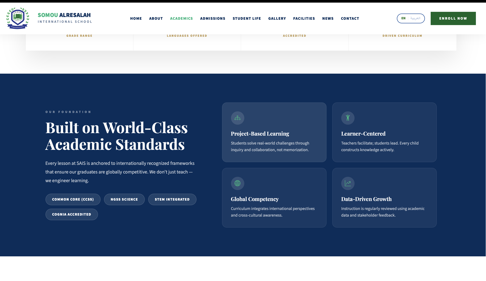
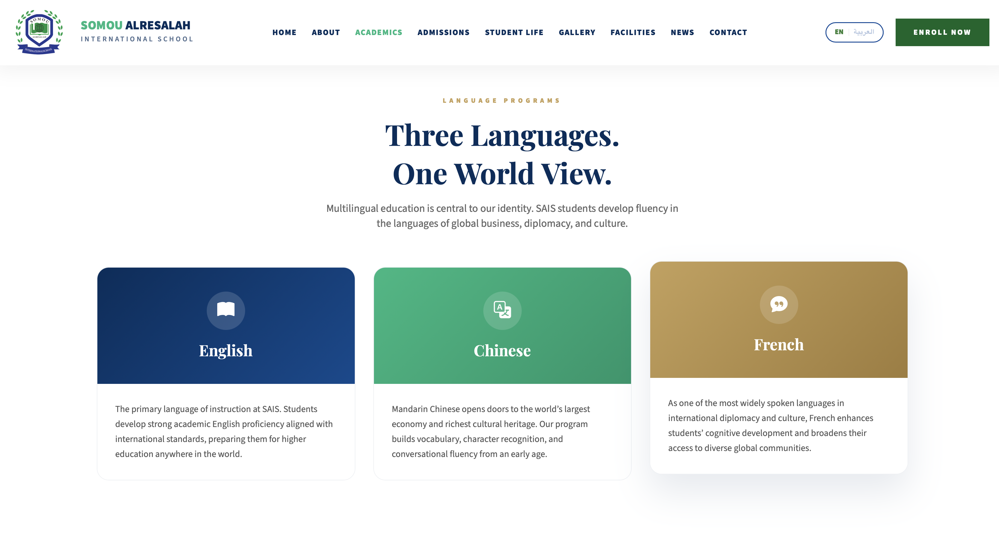
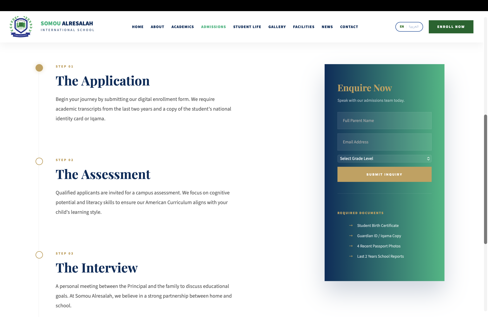
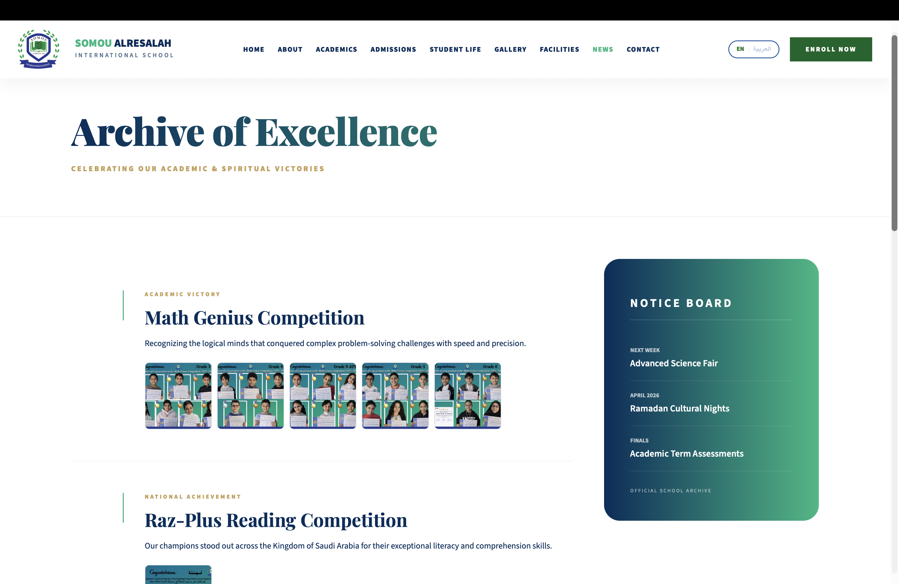

# Somou Alresalah International School — Official Website

> **Codebase handed over to the SAIS IT team for deployment.**
> This repository serves as a public showcase of the project. Source code is not included.

---

## Overview

This is the complete official website for **Somou Alresalah International School (SAIS)** — a Cognia-accredited, American-curriculum K–6 international school based in Jubail, Kingdom of Saudi Arabia.

The project was commissioned by the school and delivered as a fully custom, deployment-ready website built entirely without frameworks or a CMS — pure HTML, CSS, and Vanilla JavaScript.

**Built by:**
-  Niya — Lead Developer & Designer
- [Pranauv Skandhan](https://github.com/pranauvskandhan) - Co-Developer & Designer

---

## Screenshots

### Homepage — Hero Section

### Homepage — Stats & Authority Section

### Academics — Curriculum Standards

### Academics — Language Programs

### Facilities — Campus Hero & Exterior

### Facilities — Campus Video Tour

### Gallery — Video Archive

### Student Life — Campus Life

### Admissions — Timeline & Enquiry Form

### News — Archive of Excellence

---

## Pages Delivered

| Page | Description |
|---|---|
| **Home** | Split hero with animated student image, stats bar, Cognia & MoE authority section, Mission/Vision/Values grid |
| **About** | School history, founding stats, Mission, Vision, and Core Values |
| **Academics** | Curriculum standards, 3-language program, enrichment cards, grade-level tabs, EQ-My Mentor partnership, digital ecosystem |
| **Admissions** | Auto-advancing hero slideshow, 3-step admissions timeline, live enquiry form connected to school email |
| **Student Life** | Expandable image panels, bento card grid with image-on-top layout |
| **Gallery** | Google Drive–powered video archive with category filtering and fullscreen lightbox |
| **Facilities** | Zig-zag image/text layout across 6 facility sections, sticky campus video tour pane |
| **News & Events** | Article archive with winner photo grids, fullscreen lightbox, sticky Notice Board sidebar |
| **Contact** | Enquiry form connected to school email, embedded Google Maps |

---

## Key Features

- **Fully responsive** across all screen sizes and devices
- **Bilingual (EN / AR)** with full RTL layout switching via Google Translate integration
- **Live forms** on both Contact and Admissions pages, connected to the school's email via FormSubmit — no backend required
- **Google Drive video gallery** with category filters (Events / Academics / Campus Life) and a fullscreen lightbox with keyboard navigation
- **Scroll-driven sticky video pane** on Facilities using IntersectionObserver
- **Zig-zag layout** alternating image-left/text-right across facility sections
- **Auto-advancing slideshow** on the Admissions hero
- **Bootstrap Icons** used throughout for a professional, emoji-free UI
- **Social media footer** linking to Instagram, Snapchat, TikTok, X, Facebook, YouTube, and Phone
- **Cognia accreditation** and **Ministry of Education** credentials prominently featured

---

## Tech Stack

| Category | Tools |
|---|---|
| Structure | HTML5 |
| Styling | CSS3 (custom, no frameworks) |
| Interactivity | Vanilla JavaScript |
| Icons | Bootstrap Icons 1.11 |
| Fonts | Google Fonts (Source Sans 3, Playfair Display) |
| Translation | Google Translate API |
| Forms | FormSubmit.co |
| Video Hosting | Google Drive Embed API |
| Maps | Google Maps Embed |

---

## Project Status

> The full codebase has been handed over to the Somou Alresalah IT team for deployment.
> This repository exists as a portfolio reference only and does not contain source files.

---

*Delivered April 2026*
